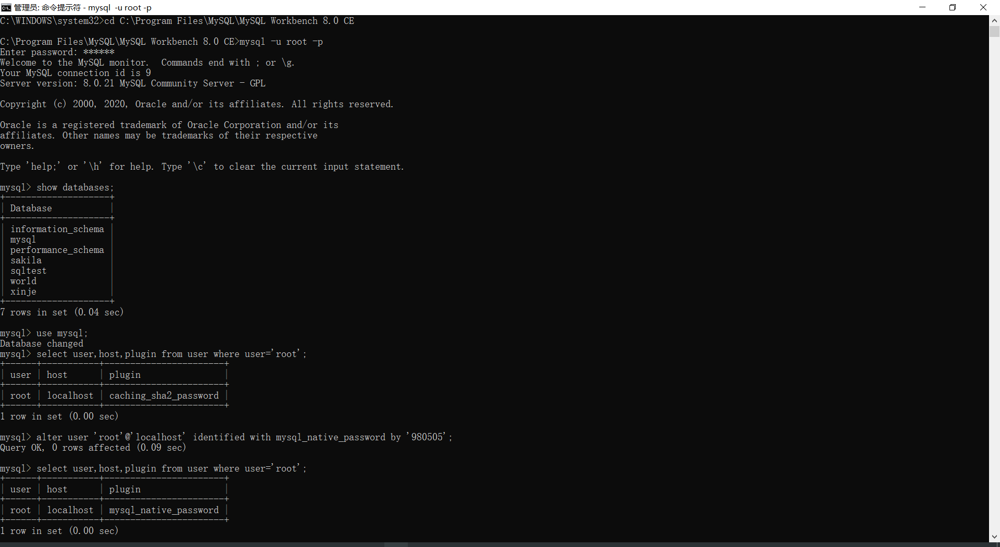

# Csharp学习文档
## 五大基本类型


### 装箱拆箱   
装箱：把一个栈上值类型的值封成引用类型的实例 （第七讲：变量与对象2最后20分钟）
拆箱：将堆上的实例拆成值类型放在栈上
栈—>堆—>堆实例化—>栈引用地址

```Csharp
int x = 100 ; 
Object obj = x; 
```
1：栈为x分配4字节空间并且内容填100的二进制
2：将x的值在堆上赋值（实例化），再将其地址赋给obj在栈上的4字节空间

## 实例化
变量、方法等类中成员在堆内存上实际分配空间

## 对象
**每个类的对象都隐藏了一个this指针，对象调用成员方法实际上都包含了一个this指针作为参数（静态成员函数除外）**

**（C++）this有个const修饰符，只能用来指向已确定的那个对象，不能更改。**

如果一个类仅仅实例化，并不保存这个实例的地址，那么该实例的**坐标**无法被定位，因此需要一个变量来存储该实例的地址，以供后续使用，这个变量即为对象。

第九讲 最后半个小时  栈

## 内存

内存溢出就是你要求分配的内存超出了系统能给你的，系统不能满足需求，最终导致溢出。 栈满时再做进栈必定产生空间溢出，叫上溢，栈空时再做退栈也产生空间溢出，称为下溢。就是分配的内存不足以放下数据项序列,称为内存溢出

内存泄漏是指你向系统申请分配内存进行使用(new)，可是使用完了以后却不归还(delete)，结果你申请到的那块内存你自己也不能再访问（也许你把它的地址给弄丢了），而系统也不能再次将它分配给需要的程序。

## 操作符
### Action 委托

**无返回值类型委托**

```c#
public static Action myAction = new Action(PrintHelloWorld);
            public static void PrintHelloWorld()
            {
                Console.WriteLine("Hello World");
            }
            myAction();
```

### 元素访问操作符[] 
```csharp
public class Brackets
        {
            Dictionary<string, Student> stu = new Dictionary<string, Student> { };

            public void InitDic()
            {
                for (int index = 1; index <= 100; index++)
                {
                    Student s = new Student();
                    s.name = "s" + index.ToString();
                    s.score = 100 + index;
                    stu.Add(s.name, s);
                }
                Student stu50 = stu["s50"];
                Console.WriteLine(stu50.score);
            }

            class Student
            {
                public string name;
                public int score;
            }
        }
```

### default 
```csharp
// 对于枚举类型
public class Enum
        {
            public static void ConsoleDefault()
            {
                Level lv = default(Level);
                Console.WriteLine(lv);
            }
            public enum Level
            {
                low = 1,
                mid = 2,
                high = 3
            }

        }
        Enum.ConsoleDefault();     
        // 尽管low为enum的首项，但默认值被改为1，所以default不为low而为0
```

### New
```csharp
// 操作符new 实例构造器 与 初始化器
public class New
        {
            public void Show1()
            {
                Form myForm = new Form() { Text = "Hello World" };
                myForm.ShowDialog();
            }
            public void Show2()  // 无对象类型
            {
                new Form() { Text = "Hello", FormBorderStyle = FormBorderStyle.SizableToolWindow }.ShowDialog();
            }

            public void Show3()  // 匿名类型
            {
                var person = new { Name = "夏东南", Age = 24 };
                Console.WriteLine(person.Name);
                Console.WriteLine(person.Age);
                Console.WriteLine(person.GetType().Name); 
                // <>f__AnonymousType0`2 匿名类型
            }
        }
```

### 取地址

```csharp
 // 取地址操作符（不可对string类型）
public class ObtainAddr
        {
            public static void Show()
            {
                unsafe // 不安全代码 属性需允许可用
                {
                    Student stu;
                    stu.Id = 1;
                    stu.score = 390;
                    Student* s = &stu;
                    s->score = 400;
                    Console.WriteLine(stu.score); // 400
                }
            }
            struct Student
            {
                public int score;
                public int Id;
            }
        }
```

### 子类与父类隐式类型转换
```Csharp
  public class ClassImplictConvert
        {
            public class Animal
            {
                public void Eat()
                {
                    Console.WriteLine("Eating...");
                }
            }
            public class Human : Animal // 继承Animal类
            {
                public void Think()
                {
                    Console.WriteLine("Thinking...");
                }
            }
            public class Teacher : Human // 继承Human类
            {
                public void Teach()
                {
                    Console.WriteLine("Teaching");
                }
            }
        }
        
			Teacher t = new Teacher();
            // t. 下有eat、think、teach方法
            Human h = t;
            // h.下有eat、think方法
            Animal a = t;
            // a.下只有eat方法
```
### &&，&和||，|
&和&&均可以表示与，但**&& 、||具有短路效应**
```Csharp
            int x = 1;
            int y = 1;
            int result = x + y;
            if (x != y && ++x != y) // x!=y-1 & x!=y
            {
                Console.WriteLine(result.ToString());
            }
```
如本例：逻辑 x！=y不成立，那么 x++ ! = y 会被短路不再执行，则x仍然为1；
若判断条件为 (x != y & ++x != y)，即便第一个条件不成立，则第二个条件仍会被执行，x=2；

```C
对于(&&,||)，运算的对象是逻辑值，也就是True/False
&&相当与中文的并且，||相当于中文的或者 。（叫做逻辑运算符又叫短路运算符）
运算结果只有下列四种情况。
True  && True  = True    （左边为true，再验证右边也为true，返回结果true）假如这是一个查询条件，则执行。
True  && False = False   （左边为true，再验证右边为false，返回结果false）假如这是一个查询条件，不执行。
False && True  = False   （左边为false，发生短路现象。右边不再执行，直接返回false）.........同样不执行。
False && False = False   （同上）
True  || True  = True    （左边为true，发生短路现象，右边不执行，直接返回true）.......执行
True  || False = True    （左边为true，发生短路现象，右边不执行，直接返回true）.......执行
False || True  = True    （左边为false，再验证右边为true，返回结果true）............执行
False || False = False   （左边为false，再验证右边也为false，返回结果false）.......不执行

    
对于(&,|)，运算的对象是位，也就是1/0，叫做位运算符
理解：0为false，1为true（通用：0表示假，所有非零的数表示真。   ######方便记忆：0，什么都没有骗人的，则为假）
运算结果只有下列四种情况。
1 & 1 = 1
1 & 0 = 0
0 & 1 = 0
0 & 0 = 0

1 | 1 = 1
1 | 0 = 1
0 | 1 = 1
0 | 0 = 0
&&和&对于他们各自的运算对象来说，结果是一样的。
```


### ?? null合并 (可空类型)
```Csharp
 public class NullableType
        {
            public static void Show()
            {
                Nullable<int> score = null;         
                // int ? score = null; 与左边表达式相等
                Console.WriteLine(score.ToString());    
                // score = score ?? 1; 如果score为null，则赋1；若不为null返回本身
                score = 150;
                Console.WriteLine(score.ToString());
            }
        }
```
### 条件操作符
```Csharp
public class Condition
        {
            public static void Show()
            {
                int x = 1;
                bool res = (x == 1) ? true : false;
                Console.WriteLine(res.ToString());
            }
        }
        
```

### This

在类体中使用this，指代该类实例化后所引用的对象

## 语句

### 反编译
#### C
项目属性->输出文件->汇编输出Fas
.asm文件

#### Csharp
Win+S 搜索 Vs Tools ->开发人员命令提示 // 或Win菜单找到VS，->Vs Tools
输入ildasm
将exe移入

### 块语句
能写在方法体里的只有三种语句
1. 声明语句
```Csharp 
byte variable = 1
```
2. 嵌入式语句
```Csharp
if(variable == 1) Console.WriteLine(variable.ToString());
```
3. 标签语句
```Csharp
Head:if(variable == 1) 
Console.WriteLine(variable.ToString());
goto Head;
```
### Try-Catch-Finally
不论如何，Finally总会被执行
```Csharp
public class TryStatement
        {
            private static double Add(string a, string b)
            {
                double A = Convert.ToDouble(a);
                double B = Convert.ToDouble(b);
                return A + B;
            }
            public static void Show()
            {
                try
                {
                    Add("a", "b");
                }
                catch (Exception Ex) // 如果未捕捉到异常，则直接跳转至finally
                {
                    Console.WriteLine(Ex.Message);
                }
                finally
                {
                    Console.WriteLine("Finished!");
                }
            }
        }
```

### DoWhile （& Goto）
Do无条件执行一次
```Csharp
public class DoWhile
        {
            public static void Show()
            {
                int sum = 0;
                int score = 0;
                do
                {
                Head: try	// Head标签
                    {
                        Console.WriteLine("Input the number1");
                        int x = Convert.ToInt32(Console.ReadLine());
                        Console.WriteLine("Input the number2");
                        int y = Convert.ToInt32(Console.ReadLine());
                        if( x + y == 100)
                    	score++;
						sum = x + y;
                    }
                    catch (Exception Ex)
                    {
                        Console.WriteLine(Ex.Message);
                        goto Head;	// 因为Continue仍会判断条件，因此用了goto
                    }
                } while (sum == 100);
                Console.WriteLine("Game Over" + "\n" + "Your Score is {0}", score);
            }
        }
```
### For
```Csharp
for(;;;) 等同于 while(true)
```

### Foreach
底层实现：迭代器
```Csharp
public class IteratorExample
        {
            public static void ShowIterator()
            {
                int[] array = new int[] { 1, 2, 3, 4, 5, 6, 7, 8, 9 };
                IEnumerator enumerator = array.GetEnumerator(); // 指月
                while(enumerator.MoveNext())
                {
                    Console.Write(enumerator.Current+" ");
                }
                Console.WriteLine("\n");
            }
            public static void ShowForeach() // 迭代器的实现
            {
                int[] array = new int[] { 1, 2, 3, 4, 5, 6, 7, 8, 9 };
                foreach (var current in array)
                {
                    Console.Write(current + " ");
                }
            }
        }
```
## 静态字段、属性、索引器、常量
### 静态字段
```Csharp
public class StaticField
        {
            public static void Show()
            {
                Console.WriteLine("-----------------静态字段------------------");
                List<Student> stu = new List<Student>();
                for (int i = 0; i < 100; i++)
                {
                    stu.Add(new Student());
                }
                Console.WriteLine(Student.Amount);
                Console.WriteLine("-------------------------------------------");
            }
            class Student
            {
                public static int Amount;   // 此处static 以便上方Student.Amount引用

                public Student()
                {
                    Student.Amount++;
                }
            }
        }
```
### 属性（Get/Set）
prop tab tab
```Csharp
public class Property
        {
            public static void Show()
            {
                try
                {
                    Console.WriteLine("-------------------属性--------------------");
                    Student stu1 = new Student();
                    stu1.Age = 20;
                    Student stu2 = new Student();
                    stu2.Age = 20;
                    Student stu3 = new Student();
                    stu3.Age = 150;
                }
                catch (Exception ex)
                {
                    Console.WriteLine(ex.Message);
                }
                finally
                {
                    Console.WriteLine("-------------------------------------------");
            	}    
            
            class Student
            {
                private int my_Age;
                public int Age
                {
                    set
                    {
                        if( value >= 0 && value <= 120)
                        { my_Age = value; }
                        else
                        {
                            throw new Exception("Age Error");
                        }
                    }
                    get {return my_Age; }
                }
            }
        }
```
### 索引器
```Csharp
public class Indexer
        {
            public static void Show()
            {
                Student stu = new Student();
                var score = stu["math"];            
                Console.WriteLine(score);       
                stu["math"] = 150;
                score = stu["math"];
                Console.WriteLine(score);
            }
            class Student
            {
                private Dictionary<string, int> scoreDictionary = new Dictionary<string, int> { };
                public int? this[string subject]
                {
                    get
                    {
                        if (scoreDictionary.ContainsKey(subject))
                        {
                            return scoreDictionary[subject];
                        }
                        else
                            return null;
                    }
                    set
                    {
                        if (value.HasValue == false)
                        {
                            throw new Exception("Set Error");
                        }
                        if (scoreDictionary.ContainsKey(subject))
                        {
                            scoreDictionary[subject] = value.Value;
                        }
                        else
                            scoreDictionary.Add(subject, value.Value);
                    }
                }
            }
        }
```
### 常量
```Csharp
public class Constant
        {
            public static void Show()
            {
                System.Diagnostics.Process.Start(Url.SoutheastUniversityUrl);

            }
            class Url
            {
                public const string SoutheastUniversityUrl = "https://cse.seu.edu.cn/xlsszs/list.htm";
            }
        }
```
## 参数
### ref 引用参数
值类型【结构体、枚举】
传值会**创建参数的副本**，副本与原始参数地址不同，但是二者指向同一地址，即
**实例在堆内存的地址**  因此改变副本并不影响原始数据

引用参数并不创建新的存储位置，**（不创建副本）**
引用参数指向的地址正是传递实参的存储位置，改变引用参数即改变原始数据


```Csharp
// 引用参数
 public class RefPara
        {
            public static void Show1()
            {
                Student stu1 = new Student();
                Console.WriteLine("Student 1 :" + stu1.ID + " " + stu1.GetHashCode());
                Console.WriteLine("------------------------------------");
                ChangeRefPara(ref stu1);
                Console.WriteLine("Student 1 :" + stu1.ID + " " + stu1.GetHashCode()); // 发现外部stu1与方法体内HashCode一致
            }
            public static void Show2()
            {
                double x = 100;
                Console.WriteLine(x);
                ChangeRefPara(ref x);
                Console.WriteLine(x);
            }
            public static void ChangeRefPara(ref double y)
            {
                y++;
            }
            public static void ChangeRefPara(ref Student stu)
            {
                stu = new Student { ID = 10 };              
                //  新建对象 并初始化ID   赋给引用变量stu
                Console.WriteLine("Student 1 :" + stu.ID + " " + stu.GetHashCode()); 
                // 打印本方法变量stu HashCode
            }
            public class Student
            {
                public int ID = 0;
            }
        }
```

### 输出参数
#### 值类型
** 不修改原始数据 **

```Csharp
public class OutPara  // 输出参数
        {
            public static void Show()
            {
                string para = "999";
                double res;
                bool final = double.TryParse(para, out res);
                if (final == true)
                // 如果try成功，则输出res；否则res赋某初值
                    Console.WriteLine(res);
                Console.WriteLine("------------------------------------");
            }
        }
```
#### 引用类型
** 修改原始数据 **

```Csharp
public class OutParaRef
        {
            public static void Show()
            {
                Student stu = null;
                bool b = Create("AutumnSoutheast", 24, out stu);
                if (b)
                    Console.WriteLine(stu.Name + " " + stu.Age);
            }
            public class Student
            {
                public int Age;
                public string Name;
            }
            public static bool Create(string stuName, int stuAge, out Student result)
            {
                result = null;
                if (string.IsNullOrEmpty(stuName))
                    return false;
                if (stuAge >= 120 || stuAge <= 20)
                    return false;
                result = new Student { Name = "夏东南", Age = 24 };
                return true;
            }
        }
```
### 数组参数
**方便输入**

```Csharp
Console.WriteLine("{0}{1}{2}",x,y,z); // 仔细观察可以发现，xyz的输入类型即为params
```
```Csharp
public class ArrParams
        {
            public static void Show()
            {
                Console.WriteLine(CalcSum(1, 2, 3, 4, 5));
            }
            public static int CalcSum(params int[] arr)
            {
                int sum = 0;
                foreach (var n in arr)
                {
                    sum += n;
                }
                return sum;
            }

        }
```
### 具名参数
增加代码**可读性**
```Csharp
public class NamedParams
        {
            public static void Show()
            {
                ShowStu(name: "夏东南", age: 24); // 具名参数可变输入顺序
            }
            public static void ShowStu(string name, int age)
            {
                Console.WriteLine("Name : " + name + " " + "Age :" + age);
            }
        }
```
### 可选参数
使方法具有** 默认参数 **值
```Csharp
public class OptionalParams
        {
            public static void Show()
            {
                Console.WriteLine(Add());     // 如果不输入参数，那么默认传入定义中的 a=1.0 b=2.0
            }
            public static double Add(double a = 1.0, double b = 2.0)
            {
                return a + b;
            }
        }
```

### 扩展方法（This 参数）
大大提高语言实用性
错误	“double”不包含“Round”的定义，并且找不到可接受类型为“double”的第一个参数的扩展方法“Round”(是否缺少 using 指令或程序集引用?)	
错误	扩展方法必须在顶级静态类中定义；DoubleExtension 是嵌套类	
解决方案：**扩展方法应当自成类体，不在其他任何类内**

```Csharp
namespace Section18
{
	class Test
    {
    	public class ExtensionMethod
        	{
            	public static void Show()
            	{	
                	double x = 3.14159;
                	double y = x.Round(4);
                	Console.WriteLine(y);
            	}
        	}
     }
    public static class DoubleExtension  // Double类型的扩展方法
    {
        public static double Round(this double num, int digits)
        {
            double result = Math.Round(num, digits);
            return result;
        }
    }
}
```
## 委托事件
### C++委托
**函数指针”升级版“**
重新认识了下Add、Sub函数


```C++
#include <stdio.h>
#include<limits>

typedef int(*Calc)(int, int); // 函数指针
typedef int(*Calc2)(int, int); // 函数指针


int Add(int a, int b)
{
	if (a > 0 && b > 0)
	{
		if (a > INT_MAX - b)
			return a + b;
		else
			return -1;
	}
	else if (a < 0 && b < 0)
	{
		if (a > INT_MIN - b)
			return a + b;
		else
			return -2;
	}
	else
		return a + b;
}

int Sub(int a, int b)
{
	if ((a > 0 && b > 0) || (a < 0 && b < 0))
	{
		return a - b;
	}
	else	if (a > 0 && b < 0)
	{
		if (a < INT_MAX + b)
			return a - b;
		else
			return 3;
	}
	else if (a < 0 && b>0)
	{
		if (a > b + INT_MIN)
			return a - b;
		else
			return 4;
	}
	else
		return a - b;
}
int main()
{
	Calc FunctionPoint1 = &Add;		
	// 利用函数指针，可以不直接调用函数，并且函数修改后无需在其他函数中再次修改
	Calc2 FunctionPoint2 = &Sub;
	int res1 = FunctionPoint1(0, 0);
	int res2 = FunctionPoint2(0, 0);
	printf("Func1Res = %d\n", res1);
	printf("Func2Res = %d\n", res2);
	system("pause");
}
```
### C#委托 
#### 一般委托

**应当写在名称空间体下，与其他类平级**

**委托是一种特殊的类类型**

**Function委托一般是有返回值，有参数的委托**

**Action一般是无返回值无参数的委托**

**泛型委托是以上两种委托的根源**

控件更新委托

```Csharp
private delegate void SetTextCallback(string text);

private void setText(string text)
{
    if (richTextBox1.InvokeRequired)
    {
        SetTextCallback method = new SetTextCallback(setText);
        Invoke(method, new object[] { text });
    }
    else
    {
        richTextBox1.Text += text;
    }
}

```


```Csharp
 public class Delegate
{
            public delegate double del(double x, double y);
            public static void Show()
            {
                Calculator calculator = new Calculator();
                Action action = new Action(calculator.Report);
                action(); // action.Invoke();
                Func<double, double, double> func1 = new Func<double, double, double>(calculator.Add);
                Func<double, double, double> func2 = new Func<double, double, double>(calculator.Sub);
                double res = func1(1, 2);
                Console.WriteLine("Func1 Show " + res);
                res = func2(1, 2);
                Console.WriteLine("Func2 Show " + res);

                Console.WriteLine("------------------------------------");
                del del1 = new del(calculator.Add);
                del del2 = new del(calculator.Sub);
                del del3 = new del(calculator.Mul);
                del del4 = new del(calculator.Div);
                double x = 100;
                double y = 200;
                Console.WriteLine(del1(x, y));
                Console.WriteLine(del2(x, y));
                Console.WriteLine(del3(x, y));
                Console.WriteLine(del4(x, y));

            }
            public class Calculator
            {
                public void Report()
                {
                    Console.WriteLine("Action Show");
                    Console.WriteLine("------------------------------------");
                }
                public double Add(double a, double b)
                {
                    return a + b;
                }
                public double Sub(double a, double b)
                {
                    return a - b;
                }
                public double Mul(double a, double b)
                {
                    return a * b;
                }
                public double Div(double a, double b)
                {
                    return a / b;
                }
            }
        }
```
```Csharp
 public class Delegate2
{
            public static void Show()
            {
                ProductFactory productFactory = new ProductFactory();
                WrapFactory wrapFactory = new WrapFactory();

                Func<Product> func1 = new Func<Product>(productFactory.MakePizza);
                Func<Product> func2 = new Func<Product>(productFactory.MakeToyCar);

                Box box1 = wrapFactory.WrapProduct(func1);
                Box box2 = wrapFactory.WrapProduct(func2);
                Console.WriteLine(box1.Products.Name);
                Console.WriteLine(box2.Products.Name);

            }
            class Product
            {
                public string Name { get; set; }
            }
            class Box
            {
                public Product Products { get; set; }
            }
            class WrapFactory
            {
                public Box WrapProduct(Func<Product> getProduct)
                {
                    Box box = new Box();
                    Product product = getProduct();
                    box.Products = product;
                    return box;
                }
            }
            class ProductFactory
            {
                public Product MakePizza()
                {
                    Product product = new Product();
                    product.Name = "Pizza";
                    return product;
                }
                public Product MakeToyCar()
                {
                    Product product = new Product();
                    product.Name = "Toy Car";
                    return product;
                }
            }
        }
```
加上日志信息的委托
```Csharp
 class NewTest
{
        public static void Show()
        {
            ProductFactory productFactory = new ProductFactory();
            WrapFactory wrapFactory = new WrapFactory();
            Action<Product> Logs = new Action<Product>(Logger.Log);

            Func<Product> func1 = new Func<Product>(productFactory.MakePizza);
            Func<Product> func2 = new Func<Product>(productFactory.MakeToyCar);


            Box box1 = wrapFactory.WrapProduct(func1, Logs);
            Box box2 = wrapFactory.WrapProduct(func2, Logs);
            Console.WriteLine(box1.Products.Name);
            Console.WriteLine(box2.Products.Name);

        }
        class Product
        {
            public string Name { get; set; }
            public int Pirce { get; set; }
        }
        class Box
        {
            public Product Products { get; set; }
        }
        class WrapFactory
        {
            public Box WrapProduct(Func<Product> getProduct, Action<Product> getLog)
            {
                Box box = new Box();
                Product product = getProduct();
                box.Products = product;
                getLog(product);
                return box;
            }
        }
        class Logger
        {
            public static void Log(Product product)
            {
                Console.WriteLine(product.Name + " created at " + DateTime.UtcNow + " price is " + product.Pirce);
            }
        }
        class ProductFactory
        {
            public Product MakePizza()
            {
                Product product = new Product();
                product.Name = "Pizza";
                product.Pirce = 12;
                return product;
            }
            public Product MakeToyCar()
            {
                Product product = new Product();
                product.Name = "Toy Car";
                product.Pirce = 100;
                return product;
            }
        }
    }
```
线程中委托
```Csharp
public class ThreadTest
{
            public static void Show()
            {
                Student s1 = new Student() { ID = 1, Color = ConsoleColor.Blue };
                Student s2 = new Student() { ID = 2, Color = ConsoleColor.Green };
                Student s3 = new Student() { ID = 3, Color = ConsoleColor.Cyan };

                Action a1 = new Action(s1.DoHomework);
                // a1.BeginInvoke();异步委托【会新开线程操作，主程序继续执行】
                Action a2 = new Action(s2.DoHomework);
                Action a3 = new Action(s3.DoHomework);
                a1();   // a1 += a2; a1 += a3; 则为多播委托，执行a1等同a1a2a3
                a2();
                a3();
            }
            public class Student
            {
                public int ID { get; set; }
                public ConsoleColor Color { get; set; }

                public void DoHomework()
                {
                    for (int i = 1; i <= 5; i++)
                    {
                        Console.ForegroundColor = this.Color;
                        Console.WriteLine("Student {0} is doing homework for {1} hour(s)", this.ID, i);
                        Thread.Sleep(500);
                    }
                }
            }
        }
```
**接口代替委托**

```Csharp	
public class InterFace
{
            public static void Show()
            {
 
            }
            interface IProductFactory
            {
                Product Make();
            }
            public class Product
            {
                public string Name { get; set; }
            }

            public class PizzaFactory : IProductFactory
            {
                public Product Make()
                {
                    Product product = new Product();
                    product.Name = "Pizza";
                    return product;
                }
            }
            public class ToyCarFactory : IProductFactory
            {
                public Product Make()
                {
                    Product product = new Product();
                    product.Name = "Toy Car";
                    return product;
                }
            }
}
```
#### 泛型委托

**泛型委托参数推断**

```Csharp
namespace Section23
{
    delegate double MyDele(double a, double b);       // 一般委托
    delegate T MyGenericDele<T>(T a, T b);            // 泛型委托
    class NormalDele
    {
        public static void Show()
        {
            MyDele myDele = new MyDele(Add);
            double res = myDele(1, 2);
            Console.WriteLine(res);
        }

        public static double Add(double a, double b)
        {
            return a + b;
        }
    }
    class GenericDele
    {
        public static void Show()
        {
            MyGenericDele<double> dele1 = new MyGenericDele<double>(Mul);
            Console.WriteLine(dele1(5, 20));
            MyGenericDele<int> dele2 = new MyGenericDele<int>(Sub);
            Console.WriteLine(dele2(10,20));

        }
        public static double Mul(double a, double b)
        {
            return a * b;
        }
        public static int Sub(int a, int b)
        {
            return a - b;
        }
    }

}

```


## 事件 

Windows窗体应用程序

```Csharp
namespace Section20_21
{
    public partial class Form1 : Form
    {
        public Form1()
        {
            InitializeComponent();

            // 方法一
            this.btnMybtn1.Click += MybtnClicked;
            this.btnMybtn2.Click += MybtnClicked;

            // 方法二 拉姆达表达式
            /* this.btnMybtn1.Click += (sender, e) =>
                {
                    txtMsg.Text = "Btn1Method2 Used";
                };  */

            // 方法三 匿名方法
            /* this.btnMybtn1.Click += delegate(object sender, EventArgs e)
            {
                txtMsg.Text = "Btn1Method3 Used";
            }; */

            // 方法四 设计器订阅同一事件
        }

        private void MybtnClicked(object sender, EventArgs e)
        {
            if (sender == this.btnMybtn1)
                txtMsg.Text = "Btn1 Clicked !";
            if (sender == this.btnMybtn2)
                txtMsg.Text = "Btn2 Clicked !";
        }
    }
}
```

效果如图所示，由于订阅同一事件，点击btn1、2均触发相同事件。


### 完整声明

```Csharp
 public class Restaurant
{
        public static void Show()
        {
            Customer customer = new Customer();
            Waiter waiter = new Waiter();
            customer.Order += waiter.Action;
            customer.Action();
            customer.PayTheBill();
        }
    }
    public class OrderEventArgs : EventArgs
    {
        public string DishName { get; set; }
        public string Size { get; set; }
    }

    public delegate void OrderEventHandler(Customer customer, OrderEventArgs e);

    public class Waiter
    {
        public void Action(Customer customer, OrderEventArgs e)
        {
            Console.WriteLine("Waiter will serve you the dish {0} ", e.DishName);
            double price = 10;
            switch (e.Size)
            {
                case "large":
                    price *= 1.5;
                    break;
                case "small":
                    price *= 0.5;
                    break;
                default:
                    break;
            }
            customer.Bill += price;
        }
    }

    public class Customer
    {
        public double Bill { get; set; }
        private OrderEventHandler orderEventHandler;
        public event OrderEventHandler Order
        {
            add
            {
                this.orderEventHandler += value;
            }
            remove
            {
                this.orderEventHandler -= value;
            }
        }

        public void WalkIn()
        {
            Console.WriteLine("Customer walks in the restaurant .");
        }
        public void SitDown()
        {
            Console.WriteLine("Customer sits down . ");
        }
        public void Think()
        {
            if (orderEventHandler != null)
            {
                OrderEventArgs e = new OrderEventArgs();
                e.DishName = "Yuxiang Pork";
                e.Size = "large";
                Console.WriteLine("Customer orders the {0} ,for {1} size ", e.DishName, e.Size);
                orderEventHandler.Invoke(this, e);
            }
        }

        public void PayTheBill()
        {
            Console.WriteLine("Customer : I will pay {0} yuan . ", Bill);
        }
        public void Action()
        {
            Console.WriteLine();
            WalkIn();
            SitDown();
            Think();
        }
}
```

### 简化声明

```Csharp
public class Customer
{
     public event OrderEventHandler Order;
	// ... ...
}
```

### 注意事项

为什么事件是基于委托类型来声明的 ?

答：
·站在source的角度来看，是为了表明source能对外传递哪些消息
·站在subscriber的角度来看，它是一种约定，是为了约束能够使用什么样签名的方法来处理(响应）事件
·委托类型的实例将用于存储（引用）事件处理器

对比事件与属性：
属性不是字段：很多时候属性是字段的包装器,这个包装器用来保护字段不被滥用
事件不是委托字段：它是委托字段的包装器 ，这个包装器用来保护委托字段不被滥用
包装器永远都不可能是被包装的东西

## Lambda表达式

```Csharp
class LambdaDele
{
        public static void Show()
        {
            Console.WriteLine(func1(100, 200));
            Console.WriteLine(func2(100, 200));
        }
        static Func<int, int, int> func1 = new Func<int, int, int>((int a, int b) => { return a + b; });
        static Func<int, int, int> func2 = (a, b) => { return a - b; };
}
```

**泛型委托lambda表达式**

```Csharp	
class GenericDele2
    {
        public static void Show()
        {
            DoSomeCalc((a, b) => { return a * b; }, 100, 200);
        }
        static void DoSomeCalc<T>(Func<T, T, T> func, T x, T y)
        {
            T res = func(x, y);
            Console.WriteLine(res);
        }
    }
```

## Linq 

```Csharp
Section23
class LinqTest
{
     // 暂无
}
```

## 构造器、析构器

```Csharp
class Test
{
    public class Class
    {
        public static void Show()
        {
            var stu1 = new Student("stu1", 1);
            var stu2 = new Student("stu2", 2);
            var stu3 = new Student("stu3", 3);
            var stu4 = new Student("stu4", 4);
            var stu5 = new Student("stu5", 5);
        }

        class Student
        {
            public int ID { get; set; }
            public string Name { get; set; }
            public static int Amount = 0;
            public Student(string name, int id)
            {
                Amount++;
                Name = name;
                ID = id;
                Console.WriteLine(" Student " + ID + " " + Name + " adds " + " Amount = " + Amount);
            }
            ~Student() // 析构器
            {
                Amount--;
                Console.WriteLine(" Student ID " + ID + " " + Name + " release its source " + " Amount = " + Amount);
            }
        }
    }
}
```

## 修饰符

### 名称空间

解决方案下新建类库

```Csharp
namespace MyLib.MyNameSpace
{
    public class Calculator
    {
        public static int Add(int a, int b)
        { 
            return a + b;
        }
    }
}
```

```Csharp
using MyLib.MyNameSpace; // 在其它项目中引用上述名称空间，即可调用Add方法
```


### public

类访问级别修饰符,被该修饰符修饰，引用装配集便可以访问

### internal

同一项目（装配集）允许访问

### private

外部成员不可访问

### protected

继承链上成员可访问，外部成员不可访问，**跨程序集**

### sealed

被该修饰符修饰后，该类成为**封闭类**，即不可被继承

上述修饰符Demo

```Csharp	
public class Animal
{
     private const int totalHunger = 8;
	 private double hunger = totalHunger;
	 public string Name { get; set; }
	 protected double amount { get; set; }
	 protected void Eat(int times, double amount)
	 {
	     double temp = hunger - amount * times;
	     hunger = temp >= 0 ? temp : hunger;
	 }
     public Animal(string name, int eatTimes)
     {
         Name = name;
     }
     ~Animal()
     {
         Console.WriteLine("Name : " + Name + "\nHunger is " + hunger + "\n");
     }
 }

 public class Tiger : Animal
 {
     public Tiger(string name, int times)
         : base(name, times)
     {
         amount = 2;
         Eat(times, amount);
     }
 }

 public class Squirrel : Animal
 {
     public Squirrel(string name, int times)
         : base(name, times)
     {
         amount = 0.5;
         Eat(times, amount);
     }
 }

 public sealed class NewAnimal : Animal
 {
     public NewAnimal(string name, int times)
         : base(name, times)
     {

     }
 }

```

## 继承

子类在基类已有的成员的基础上，对基类进行的横向与纵向的扩展。

横向：对类成员个数的扩充

纵向：对类成员版本更新（类成员重写）

创建一个类对象，编译器会先实例化该类的基类、构造器，后再对基类的派生类做同样操作，直到创建的类

**实例构造器不可直接被继承**

```Csharp
class Derive
{
    public static void Show()
    {
        Vehicle v = new Vehicle("v1");
        Ship s = new Ship("s1");
        SpaceShip ss = new SpaceShip("ss1");
    }
    public class Vehicle
    {
        public string Owner { get; set; }
        public Vehicle(string Name)
        {
            Owner = Name;
            Console.WriteLine(Owner);
        }
    }
    internal class Ship : Vehicle  // internal本项目可见
    {
        public Ship(string Name)
            : base(Name)
        {
            // 实例构造器不可被继承
        }
    }
    private class SpaceShip : Vehicle // 外部调用不可见
    {
        public SpaceShip(string Name)
            : base(Name)
        {
            // 实例构造器不可被继承
        }
    }
}
```

## 重写

**Virtual:**   虚、虚函数，名存实亡的（函数、方法）

**Override:**  方法、属性均可被重写（需要方法可见、签名一致）

**Csharp:**  有多态（代差）

```Csharp
public class Plants
{
    public virtual void ReleaseOxygen()
    {
        Console.WriteLine("I am releasing oxygen now !");
    }
}

public class GreenTree : Plants
{
    public override void ReleaseOxygen()
    {
        Console.WriteLine("GreenTree is releasing oxygen now !");
    }
}

```

**Python:**  无多态（代差）

```Python
class Plants:
    def release(self):
        print("Plant is releasing oxygen now !")


class GreenTree(Plants):
    def release(self):
        print("GreenTree is releasing oxygen now !")


class Leaves(GreenTree):
    def release(self):
        print("Leaves are releasing oxygen now !")


p = Plants()
g = GreenTree()
l = Leaves()

p.release()
g.release()
l.release()
```

## 多态

父类变量引用子类实例，会得到继承链上重写的最新实例

```Csharp
public class Flowers : GreenTree
{
    public void ReleaseOxygen() // 隐藏所派生类方法
    {
        Console.WriteLine("Flowers are obsorbing oxygen now !");
    }
}
public class Leaves : GreenTree
{
    public override void ReleaseOxygen()
    {
        Console.WriteLine("Leaves are releasing oxygen now !");
    }
}

Plants l = new Leaves();        // 可以左边 但是不可以 Leaves l = new Plants();
Flowers f = new Flowers();   	// 直接调用方法，并不会出现源方法  
l.ReleaseOxygen();				// 以上这种对象与实例不同类则被称之为 多态
f.ReleaseOxygen();
```

## 接口与抽象类

1. 接口与抽象类均为“软件工程的产物”

2. 具体类->抽象类->接口：越来越抽象，内部实现的东西越来越少

3. 抽象类是未完全实现逻辑的类（可以有字段和非public成员，代表了“具体逻辑”）

4. 抽象类为复用而生：专门作为基类来使用，也具有解耦功能

5. 封装确定的，开放不确定的，推迟到合适的子类中去实现

6. 接口是完全未实现逻辑的 “类” ，（纯 “虚” 类；只有函数成员；成员全部public）

7. 接口为解耦而生：“高内聚，低耦合”，方便单元测试

8. 接口是一个 “ 协约 ”，早已为工业生产所熟知（有分工必有协作，有协作必有协约）

9. 他们都不能实例化，只能用来声明变量，引用具体类（concrete class）的实例

10. 接口不能包括**字段**

    

11. Virtua：当一个方法被声明为Virtual时，它是一个虚拟方法，直到你使用ClassName variable = new ClassName();声明一个类的实例之前，它都不存在于真实的内存空间中。这个关键字在类的继承中非常常用，用来提供类方法的多态性支持。

12. abstract：抽象方法声明使用，是必须被派生类覆写的方法，抽象类就是用来被继承的；可以看成是没有实现体的虚方法；如果类中包含抽象方法，那么类就必须定义为抽象类，不论是否还包含其他一般方法；抽象类不能有实体的。

13. overrride：表示重写 这个类是继承于Shape类
     virtual，abstract是告诉其它想继承于他的类 你可以重写我的这个方法或属性，否则不允许。

### 抽象类

实例代码

```Csharp
public abstract class Section28
{
    public Section28()
    {
        Name = "Animal";
    }
    public string Name { get; set; }
    public abstract void Eat();
}
public class Monkey : Section28
{
    public Monkey()
    {
        Name = "Monkey";
    }
    public override void Eat()
    {
        Console.WriteLine(Name + " is eating .");
    }
}
public class Bird : Section28
{
    public Bird()
    {
        Name = "Bird";
    }
    public void Fly()
    {
        Console.WriteLine("Bird is flying .");
    }
    public override void Eat()
    {
        Console.WriteLine(Name + " is eating .");
    }
}
public class Human : Section28
{
    public Human()
    {
        Name = "Human";
    }
    public override void Eat()
    {
        Console.WriteLine(Name + " is having the meal .");
    }
    public void MakeDishes()
    {
        Console.WriteLine(Name + " is making dishes .");
    }
}
```


### 接口


示例代码1

```Csharp
public interface IVehicle
{
    void Fly();
    void Accelerate();
    void SlowDown();
}
public class Pilot : IVehicle
{
    public void Fly()
    {
        Console.WriteLine("Pilot is flying .");
    }
    public void Accelerate()
    {
        Console.WriteLine("Pilot is accelerating .");
    }
    public void SlowDown()
    {
        Console.WriteLine("Pilot is slowing down .");
    }
}
```

示例代码2

```CSharp
public interface IPhone
{
    void Dail();
    void PickUp();
    void SendMsg();
    void RecvMsg();
}
public class PhoneUser
{
    private IPhone _phone;
    public PhoneUser(IPhone phone)
    {
        _phone = phone;
    }
    public void UsePhone()
    {
        _phone.Dail();
        _phone.PickUp();
        _phone.SendMsg();
        _phone.RecvMsg();
    }
}

public class NokiaPhone : IPhone
{
    public void Dail()
    {
        Console.WriteLine("Nokia dails .");
    }
    public void PickUp()
    {
        Console.WriteLine("Nokia picks up .");
    }
    public void SendMsg()
    {
        Console.WriteLine("Nokia Sends messages .");
    }
    public void RecvMsg()
    {
        Console.WriteLine("Nokia receives messages .");
    }
}

public class Huawei : IPhone
{
    public void Dail()
    {
        Console.WriteLine("Huawei dails .");
    }
    public void PickUp()
    {
        Console.WriteLine("Huawei picks up .");
    }
    public void SendMsg()
    {
        Console.WriteLine("Huawei Sends messages .");
    }
    public void RecvMsg()
    {
        Console.WriteLine("Huawei receives messages .");
    }
}

// 调用
var pu1 = new PhoneUser(new NokiaPhone());
pu1.UsePhone();
Console.WriteLine("---------------------------------------------------");
var pu2 = new PhoneUser(new Huawei());
pu2.UsePhone();

// 基接口（Base）：
// C# 只可以有一个基类，可以有多个基接口
```

## 依赖反转

```Csharp
//-------------------------------依赖反转-----------------------------//
public interface IPowerSuply
{
     int GetPower();
}
public class PowerSuply : IPowerSuply
{
    public int GetPower() { return 200; }
}
public class DeskFan
{
    private IPowerSuply _powerSuply;
    public DeskFan(IPowerSuply powerSuply)
    {
        _powerSuply = powerSuply;
    }

    public string Work()
    {
        int power = _powerSuply.GetPower();
        if (power <= 0)
            return "Doesn't work ";
        else if (power <= 100)
            return "Work slowly";
        else if (power <= 200)
            return "Work Fine";
        else
            return "Work Out !";
    }
}

//-------------------------------调用-----------------------------//
var df = new DeskFan(new PowerSuply());
Console.WriteLine(df.Work());

//-------------------------------测试-----------------------------//
public class DeskFanTest
{
    [TestMethod]
    public void WorkTest()
    {
        string expect = "Work Fine";
        var df = new DeskFan(new Power1());
        Assert.IsTrue(expect == df.Work());
    }
    class Power1 : IPowerSuply
    {
        public int GetPower() { return 200; }
    }
}

```

## 接口隔离

1. **Example 1** 

```Csharp
interface IGreenLeaves
{
    void Photosynthesize();
}
interface IFlowers
{
    void AbsorbOxygen();
}

public class GreenPlants : IGreenLeaves, IFlowers
    {
        public void Photosynthesize()
        {
            Console.WriteLine("GreenTree is photosynthesizing ");
        }
        public void AbsorbOxygen()
        {
            Console.WriteLine("GreenTree is absorbing oxygen ");
        }
    }

public class Rose : IFlowers
{
    public void AbsorbOxygen()
    {
        Console.WriteLine("Rose is absorbing oxygen ");
    }
}

```

2. **Example 2**

```Csharp
public class ReadOnlyCollection : IEnumerable
{
    private int[] _array;
    public ReadOnlyCollection(int[] array)
        {
            _array = array;
        }

    public IEnumerator GetEnumerator()
    {
        return new Enumerator(this);
    }
    public class Enumerator : IEnumerator
    {
        public ReadOnlyCollection _collection;
        private int _head;
        public Enumerator(ReadOnlyCollection collection)
        {
            _collection = collection;
            _head = -1;
        }
        public object Current
        {
            get
            {
                object o = _collection._array[_head];
                return o;
            }
        }
        public bool MoveNext()
        {
            if (++_head < _collection._array.Length)
                return true;
            else
                return false;
        }
        public void Reset()
        {
            _head = -1;
        }
    }
}
```

3. **Example3（接口显式实现）**

```csharp
interface IGentleman
{
    void Warm();
}

public interface IRogue
{
    void Bully();
}

public class People : IGentleman,IRogue
{
    public void Warm()
    {
        Console.WriteLine("I am a warmheart person ");
    }
    void IRogue.Bully()
    {
        Console.WriteLine("I bullied some people before ");
    }
}

// 调用
var pp = new People();
pp.Warm();
var ppp = pp as IRogue; // var ppp = (IRogue)pp;
ppp.Bully();
```

## 反射

```Csharp
public interface IMetal
{
    void Oxidize();
    void Sold();
}

public class Iron : IMetal
{
    private string Name;

    public Iron()
    {
        Name = "Iron";
    }
    public void Oxidize()
    {
        Console.WriteLine(Name + " is oxidized ");
    }
    public void Sold()
    {
        Console.WriteLine(Name + " is sold cheap ");
    }
}
public class Aurum : IMetal
{
    private string Name;

    public Aurum()
    {
        Name = "Aurum";
    }
    public void Oxidize()
    {
        Console.WriteLine(Name + " is merely oxidized ");
    }
    public void Sold()
    {
        Console.WriteLine(Name + " is sold expensive ");
    }
}

// 调用
IMetal mt = new Aurum();
Type t = mt.GetType();
object o = Activator.CreateInstance(t);
MethodInfo oxidize = t.GetMethod("Oxidize");
MethodInfo sold = t.GetMethod("Sold");
oxidize.Invoke(o, null);
oxidize.Invoke(o, null);
```

## 依赖注入（Part30）


## SDk与第三方插件


## 泛型


### 泛型类

```Csharp
public class Book
{
        public string Name { get; set; }
}
public class Apple
{
        public string Color { get; set; }
}
/*-------------------Version 1.0 & 1.1 ----------------------*/
public class Box
{
    //public Apple Apple { get; set; }
    //public Book Book { get; set; }
    public Object Cargo { get; set; }
}
/*-------------------Version 1.2 ----------------------*/
public class NewBox<TCargo>
{
    public TCargo Cargo { get; set; }
}

// 调用
/*-------------------Version 1.0 ----------------------*/

Apple ap1 = new Apple() { Color = "Red" };
Book bk1 = new Book() { Name = "New Book" };
//Box bx1 = new Box() { Apple = ap1 };
//Box bx2 = new Box() { Book = bk1 };

/*-------------------Version 1.1 ----------------------*/

Box bx1 = new Box() { Cargo = ap1 };
Box bx2 = new Box() { Cargo = bk1 };
if (bx1.Cargo as Apple != null)
    Console.WriteLine((bx1.Cargo as Apple).Color);
if (bx2.Cargo as Apple != null)
    Console.WriteLine((bx2.Cargo as Apple).Color);

/*-------------------Version 1.2 ----------------------*/

Apple apple = new Apple() { Color = "Green" };
Book book = new Book() { Name = "计算机科学与技术" };
NewBox<Apple> box1 = new NewBox<Apple>() { Cargo = apple };
NewBox<Book> box2 = new NewBox<Book>() { Cargo = book };
Console.WriteLine(box1.Cargo.Color);
Console.WriteLine(box2.Cargo.Name);
```


### 泛型接口

```Csharp
interface IUnique<Tid>
{
     Tid ID { get; set; }
}
public class Student<Tid> : IUnique<Tid>
{
    public Tid ID { get; set; }
    public string Name { get; set; }
}

// 调用
Student<int> student = new Student<int> { };
student.ID = 100000;
student.Name = "Southeast Autumn";

/*---------------- New -----------------------*/
public class Student2: IUnique<ulong>
{
    public ulong  ID { get; set; }
    public string Name { get; set; }
}

Student<int> student = new Student<int> { };
student.ID = 100000;
student.Name = "Southeast Autumn";
Console.WriteLine(student.ID + " " + student.Name);
Student2 stu2 = new Student2();
stu2.ID = 1000000000000001;
stu2.Name = "Southeast Autumn";
Console.WriteLine(stu2.ID + " " + stu2.Name);

```

### 泛型委托

**无返回值使用Action，有返回值使用Func**

```Csharp
public class Function
{
    public static T[] Zip<T>(T[] a, T[] b)
        {
            int ai = 0;
            int bi = 0;
            int zi = 0;
            T[] Zipped = new T[a.Length + b.Length];
            do
            {
                if (ai < a.Length) Zipped[zi++] = a[ai++];
                if (bi < b.Length) Zipped[zi++] = b[bi++];
            } while (zi != a.Length + b.Length);
            return Zipped;
        }

    public static void Add(int a, int b)
    {
        Console.WriteLine(a + b);
    }
    public static void Mul(double a, double b)
    {
        Console.WriteLine(a * b);
    }
}

// 调用
Console.WriteLine("------------------- Generic Function ----------------------");
int[] a1 = new int[] { 1, 2, 3, 4, 5 };
int[] a2 = new int[] { 1, 2, 3, 4, 5, 6 };
double[] d1 = new double[] { 1.1, 1.2, 1.3, 1.4, 1.5 };
double[] d2 = new double[] { 1.1, 1.2, 1.3, 1.4, 1.5, 1.6 };
Function.Zip(d1, d2);
Action<int, int> add = Function.Add; add(1, 2);
Action<double, double> Mul = Function.Mul; Mul(1.0, 3.0);
```

## 枚举类型

```Csharp
public enum Level
{
    Employee = 100,
    Manager = 101,
    Boss = 99,
    BigBoss,
}

// 调用
Console.WriteLine("----------------------- Enum -------------------------");
Console.WriteLine((int)Level.Employee);
Console.WriteLine((int)Level.Manager);
Console.WriteLine((int)Level.Boss);
Console.WriteLine((int)Level.BigBoss);
// 输出
100
101
99
100
```

**enum类型成员本身是有默认值的，如果不赋初值，那么下一成员值为上一成员值+1，即便该值已存在**


```Csharp	
public enum Skill
{
    Drive = 1,
    Program = 2,
    Cook = 4,
    Teach = 8
}

public class Person
{
    public int ID { get; set; }
    public string Name { get; set; }
    public Level Level { get; set; }
    public Skill Skill { get; set; }
}

// 调用
Person person = new Person();
person.Skill = Skill.Cook | Skill.Drive | Skill.Program | Skill.Teach;
Console.WriteLine(person.Skill);
Console.WriteLine((person.Skill & Skill.Cook) > 0);

// 输出
15
True
```

## 结构体

结构体可以由接口派生而来，不可以派生自其它结构体或类

结构体不可以有显式无参构造器

```Csharp
interface ISpeak
{
    void Speak();
}
public struct Stu
{
    public int ID { get; set; }
    public string Name { get; set; }
    public int Age { get; set; }
    public void Speak()
    {
        Console.WriteLine("I have achieved it !");
    }
}

// 调用
Stu stu = new Stu() { ID = 1, Name = "夏东南", Age = 24 };
stu.Speak();
Console.WriteLine("ID " + stu.ID + "    Name " + stu.Name + "    Age " + stu.Age);
Console.WriteLine();


// 输出
I have achieved it !
ID 1    Name 夏东南    Age 24
```

## 数据库使用

### 一般使用

```Csharp
public static void Connect() //  暂时叫Connect
{
   	const string conStr = "data source=localhost; initial catalog= ; user id=root; pwd= ;charset = utf8";
    // server=127.0.0.1/localhost 代表本机，端口号port默认是3306可以不写, catalog 是数据库
    MySqlConnection conn = new MySqlConnection(connetStr);
    try
    {
        conn.Open();   //打开通道，建立连接，可能出现异常,使用try catch语句
        MessageBox.Show("已经建立连接");
        //在这里使用代码对数据库进行增删查改
    }
    catch (MySqlException ex)
    {
        MessageBox.Show(ex.Message);
    }
    finally
    {
        conn.Close();
    }
}

```


```Csharp
string verifyStr1 = "select * from staffs where id =  " + ID + " and password = " + Password;
// 从staffs表中，查找id为ID，password为Password的字段
List<string> result = new List<string>() { };
while (mySqlReader.Read())
{							 			  // 表中字段总数
    for (int fieldIndex = 1; fieldIndex < mySqlReader.FieldCount; fieldIndex++)
    {
        if (mySqlReader[fieldIndex].ToString() == "")
            break;
        result.Add(mySqlReader[fieldIndex].ToString());
    }
}

```

### 连接加密



报错：Navicat连接Mysql报错：Client does not support authentication protocol requested by server；
解决：alter user 'root'@'localhost' identified with mysql_native_password by '********';

## 模态框

```Csharp
DialogResult dr = MessageBox.Show("确认退出程序？", "提示", MessageBoxButtons.YesNo, MessageBoxIcon.Question);
if (dr == DialogResult.OK)
{
    System.Environment.Exit(0);
}
```

