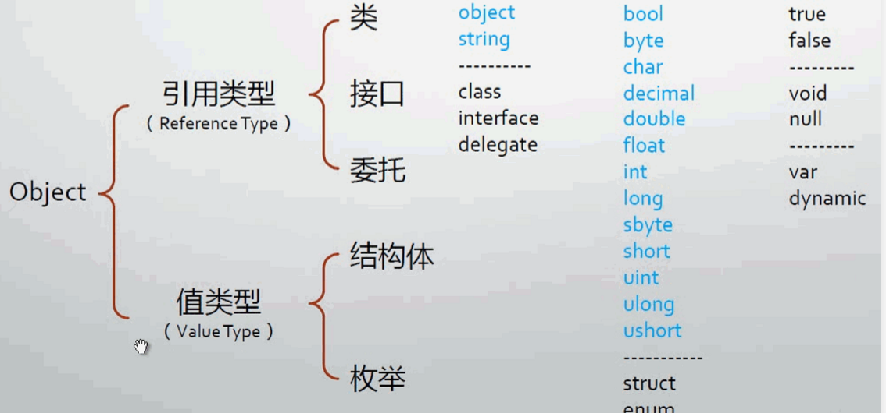

# Csharp学习文档
## 五大基本类型 重中之重



### 装箱拆箱   
装箱：把一个栈上值类型的值封成引用类型的实例 （第七讲：变量与对象2最后20分钟）
拆箱：将堆上的实例拆成值类型放在栈上
栈—>堆—>堆实例化—>栈引用地址

```Csharp
int x = 100 ; 
Object obj = x; 
```
1：栈为x分配4字节空间并且内容填100的二进制
2：将x的值在堆上赋值（实例化），再将其地址赋给obj在栈上的4字节空间

### 实例化
变量、方法等类中成员在堆内存上实际分配空间

### 对象
如果一个类仅仅实例化，并不保存这个实例的地址，那么该实例的**坐标**无法被定位，因此需要一个变量来存储该实例的地址，以供后续使用，这个变量即为对象。

第九讲 最后半个小时  栈

### 操作符
#### Action 委托
```c#
public static Action myAction = new Action(PrintHelloWorld);
            public static void PrintHelloWorld()
            {
                Console.WriteLine("Hello World");
            }
            myAction();
```

#### 元素访问操作符[] 
```csharp
public class Brackets
        {
            Dictionary<string, Student> stu = new Dictionary<string, Student> { };

            public void InitDic()
            {
                for (int index = 1; index <= 100; index++)
                {
                    Student s = new Student();
                    s.name = "s" + index.ToString();
                    s.score = 100 + index;
                    stu.Add(s.name, s);
                }
                Student stu50 = stu["s50"];
                Console.WriteLine(stu50.score);
            }

            class Student
            {
                public string name;
                public int score;
            }
        }
```

#### default 
```csharp
// 对于枚举类型
public class Enum
        {
            public static void ConsoleDefault()
            {
                Level lv = default(Level);
                Console.WriteLine(lv);
            }
            public enum Level
            {
                low = 1,
                mid = 2,
                high = 3
            }

        }
        Enum.ConsoleDefault();     
        // 尽管low为enum的首项，但默认值被改为1，所以default不为low而为0
```

#### New
```csharp
// 操作符new 实例构造器 与 初始化器
public class New
        {
            public void Show1()
            {
                Form myForm = new Form() { Text = "Hello World" };
                myForm.ShowDialog();
            }
            public void Show2()  // 无对象类型
            {
                new Form() { Text = "Hello", FormBorderStyle = FormBorderStyle.SizableToolWindow }.ShowDialog();
            }

            public void Show3()  // 匿名类型
            {
                var person = new { Name = "夏东南", Age = 24 };
                Console.WriteLine(person.Name);
                Console.WriteLine(person.Age);
                Console.WriteLine(person.GetType().Name); 
                // <>f__AnonymousType0`2 匿名类型
            }
        }
```

#### 取地址
```csharp
 // 取地址操作符（不可对string类型）
public class ObtainAddr
        {
            public static void Show()
            {
                unsafe // 不安全代码 属性需允许可用
                {
                    Student stu;
                    stu.Id = 1;
                    stu.score = 390;
                    Student* s = &stu;
                    s->score = 400;
                    Console.WriteLine(stu.score); // 400
                }
            }
            struct Student
            {
                public int score;
                public int Id;
            }
        }
```

#### 子类与父类隐式类型转换
```Csharp
  public class ClassImplictConvert
        {
            public class Animal
            {
                public void Eat()
                {
                    Console.WriteLine("Eating...");
                }
            }
            public class Human : Animal // 继承Animal类
            {
                public void Think()
                {
                    Console.WriteLine("Thinking...");
                }
            }
            public class Teacher : Human // 继承Human类
            {
                public void Teach()
                {
                    Console.WriteLine("Teaching");
                }
            }
        }
        
			Teacher t = new Teacher();
            // t. 下有eat、think、teach方法
            Human h = t;
            // h.下有eat、think方法
            Animal a = t;
            // a.下只有eat方法
```
#### 操作符&& 和&
&和&&均可以表示逻辑与，但**&& 具有短路效应**
```Csharp
            int x = 1;
            int y = 1;
            int result = x + y;
            if (x != y && ++x != y) // x!=y-1 & x!=y
            {
                Console.WriteLine(result.ToString());
            }
```
如本例：逻辑 x！=y不成立，那么 x++ ! = y 会被短路不再执行，则x仍然为1；
若判断条件为 (x != y & ++x != y)，即便第一个条件不成立，则第二个条件仍会被执行，x=2；

#### ?? null合并 (可空类型)
```Csharp
public class NullableType
        {
            public static void Show()
            {
                Nullable<int> score = null;         
                // int ? score = null; 与左边表达式相等
                Console.WriteLine(score.ToString());    
                // score = score ?? 1; 如果score为null，则赋1；若不为null返回本身
                score = 150;
                Console.WriteLine(score.ToString());
            }
        }
```
#### 条件操作符
```Csharp
public class Condition
        {
            public static void Show()
            {
                int x = 1;
                bool res = (x == 1) ? true : false;
                Console.WriteLine(res.ToString());
            }
        }
        
```

### 语句
#### 反编译
##### C
项目属性->输出文件->汇编输出Fas
.asm文件

##### Csharp
Win+S 搜索 Vs Tools ->开发人员命令提示 // 或Win菜单找到VS，->Vs Tools
输入ildasm
将exe移入

#### 块语句
能写在方法体里的只有三种语句
1. 声明语句
```Csharp 
byte variable = 1
```
2. 嵌入式语句
```Csharp
if(variable == 1) Console.WriteLine(variable.ToString());
```
3. 标签语句
```Csharp
Head:if(variable == 1) 
Console.WriteLine(variable.ToString());
goto Head;
```
#### Try-Catch-Finally
不论如何，Finally总会被执行
```Csharp
public class TryStatement
        {
            private static double Add(string a, string b)
            {
                double A = Convert.ToDouble(a);
                double B = Convert.ToDouble(b);
                return A + B;
            }
            public static void Show()
            {
                try
                {
                    Add("a", "b");
                }
                catch (Exception Ex)
                {
                    Console.WriteLine(Ex.Message);
                }
                finally
                {
                    Console.WriteLine("Finished!");
                }
            }
        }
```

#### DoWhile （& Goto）
Do无条件执行一次
```Csharp
public class DoWhile
        {
            public static void Show()
            {
                int sum = 0;
                int score = 0;
                do
                {
                Head: try	// Head标签
                    {
                        Console.WriteLine("Input the number1");
                        int x = Convert.ToInt32(Console.ReadLine());
                        Console.WriteLine("Input the number2");
                        int y = Convert.ToInt32(Console.ReadLine());
                        if( x + y == 100)
                    	score++;
						sum = x + y;
                    }
                    catch (Exception Ex)
                    {
                        Console.WriteLine(Ex.Message);
                        goto Head;	// 因为Continue仍会判断条件，因此用了goto
                    }
                } while (sum == 100);
                Console.WriteLine("Game Over" + "\n" + "Your Score is {0}", score);
            }
        }
```
#### For
```Csharp
for(;;;) 等同于 while(true)
```

#### Foreach
底层实现：迭代器
```Csharp
public class IteratorExample
        {
            public static void ShowIterator()
            {
                int[] array = new int[] { 1, 2, 3, 4, 5, 6, 7, 8, 9 };
                IEnumerator enumerator = array.GetEnumerator(); // 指月
                while(enumerator.MoveNext())
                {
                    Console.Write(enumerator.Current+" ");
                }
                Console.WriteLine("\n");
            }
            public static void ShowForeach() // 迭代器的实现
            {
                int[] array = new int[] { 1, 2, 3, 4, 5, 6, 7, 8, 9 };
                foreach (var current in array)
                {
                    Console.Write(current + " ");
                }
            }
        }
```
### 静态字段、属性、索引器、常量
#### 静态字段
```Csharp
public class StaticField
        {
            public static void Show()
            {
                Console.WriteLine("-----------------静态字段------------------");
                List<Student> stu = new List<Student>();
                for (int i = 0; i < 100; i++)
                {
                    stu.Add(new Student());
                }
                Console.WriteLine(Student.Amount);
                Console.WriteLine("-------------------------------------------");
            }
            class Student
            {
                public static int Amount;   // 此处static 以便上方Student.Amount引用

                public Student()
                {
                    Student.Amount++;
                }
            }
        }
```
#### 属性（Get/Set）
prop tab tab
```Csharp
public class Property
        {
            public static void Show()
            {
                try
                {
                    Console.WriteLine("-------------------属性--------------------");
                    Student stu1 = new Student();
                    stu1.Age = 20;
                    Student stu2 = new Student();
                    stu2.Age = 20;
                    Student stu3 = new Student();
                    stu3.Age = 150;
                }
                catch (Exception ex)
                {
                    Console.WriteLine(ex.Message);
                }
                finally
                {
                    Console.WriteLine("-------------------------------------------");
            	}    
            
            class Student
            {
                private int my_Age;
                public int Age
                {
                    set
                    {
                        if( value >= 0 && value <= 120)
                        { my_Age = value; }
                        else
                        {
                            throw new Exception("Age Error");
                        }
                    }
                    get {return my_Age; }
                }
            }
        }
```
#### 索引器
```Csharp
public class Indexer
        {
            public static void Show()
            {
                Student stu = new Student();
                var score = stu["math"];            
                Console.WriteLine(score);       
                stu["math"] = 150;
                score = stu["math"];
                Console.WriteLine(score);
            }
            class Student
            {
                private Dictionary<string, int> scoreDictionary = new Dictionary<string, int> { };
                public int? this[string subject]
                {
                    get
                    {
                        if (scoreDictionary.ContainsKey(subject))
                        {
                            return scoreDictionary[subject];
                        }
                        else
                            return null;
                    }
                    set
                    {
                        if (value.HasValue == false)
                        {
                            throw new Exception("Set Error");
                        }
                        if (scoreDictionary.ContainsKey(subject))
                        {
                            scoreDictionary[subject] = value.Value;
                        }
                        else
                            scoreDictionary.Add(subject, value.Value);
                    }
                }
            }
        }
```
#### 常量
```Csharp
public class Constant
        {
            public static void Show()
            {
                System.Diagnostics.Process.Start(Url.SoutheastUniversityUrl);

            }
            class Url
            {
                public const string SoutheastUniversityUrl = "https://cse.seu.edu.cn/xlsszs/list.htm";
            }
        }
```
### 参数
#### ref 引用参数
** 值类型【结构体、枚举】**
传值会**创建参数的副本**，副本与原始参数地址不同，但是二者指向同一地址，即
**实例在堆内存的地址**  因此改变副本并不影响原始数据

引用参数并不创建新的存储位置，**（不创建副本）**
引用参数指向的地址正是传递实参的存储位置，改变引用参数即改变原始数据


```Csharp
// 引用参数
 public class RefPara
        {
            public static void Show1()
            {
                Student stu1 = new Student();
                Console.WriteLine("Student 1 :" + stu1.ID + " " + stu1.GetHashCode());
                Console.WriteLine("------------------------------------");
                ChangeRefPara(ref stu1);
                Console.WriteLine("Student 1 :" + stu1.ID + " " + stu1.GetHashCode()); // 发现外部stu1与方法体内HashCode一致
            }
            public static void Show2()
            {
                double x = 100;
                Console.WriteLine(x);
                ChangeRefPara(ref x);
                Console.WriteLine(x);
            }
            public static void ChangeRefPara(ref double y)
            {
                y++;
            }
            public static void ChangeRefPara(ref Student stu)
            {
                stu = new Student { ID = 10 };              //  新建对象 并初始化ID   赋给引用变量stu
                Console.WriteLine("Student 1 :" + stu.ID + " " + stu.GetHashCode()); // 打印本方法变量stu HashCode
            }
            public class Student
            {
                public int ID = 0;
            }
        }
```

#### 输出参数
##### 值类型
** 不修改原始数据 **
```Csharp
public class OutPara  // 输出参数
        {
            public static void Show()
            {
                string para = "999";
                double res;
                bool final = double.TryParse(para, out res);
                if (final == true)
                // 如果try成功，则输出res；否则res赋某初值
                    Console.WriteLine(res);
                Console.WriteLine("------------------------------------");
            }
        }
```
##### 引用类型
** 修改原始数据 **
```Csharp
public class OutParaRef
        {
            public static void Show()
            {
                Student stu = null;
                bool b = Create("AutumnSoutheast", 24, out stu);
                if (b)
                    Console.WriteLine(stu.Name + " " + stu.Age);
            }
            public class Student
            {
                public int Age;
                public string Name;
            }
            public static bool Create(string stuName, int stuAge, out Student result)
            {
                result = null;
                if (string.IsNullOrEmpty(stuName))
                    return false;
                if (stuAge >= 120 || stuAge <= 20)
                    return false;
                result = new Student { Name = "夏东南", Age = 24 };
                return true;
            }
        }
```
#### 数组参数
**方便输入**

```Csharp
Console.WriteLine("{0}{1}{2}",x,y,z); // 仔细观察可以发现，xyz的输入类型即为params
```
```Csharp
public class ArrParams
        {
            public static void Show()
            {
                Console.WriteLine(CalcSum(1, 2, 3, 4, 5));
            }
            public static int CalcSum(params int[] arr)
            {
                int sum = 0;
                foreach (var n in arr)
                {
                    sum += n;
                }
                return sum;
            }

        }
```
#### 具名参数
增加代码**可读性**
```Csharp
public class NamedParams
        {
            public static void Show()
            {
                ShowStu(name: "夏东南", age: 24); // 具名参数可变输入顺序
            }
            public static void ShowStu(string name, int age)
            {
                Console.WriteLine("Name : " + name + " " + "Age :" + age);
            }
        }
```
#### 可选参数
使方法具有** 默认参数 **值
```Csharp
public class OptionalParams
        {
            public static void Show()
            {
                Console.WriteLine(Add());     // 如果不输入参数，那么默认传入定义中的 a=1.0 b=2.0
            }
            public static double Add(double a = 1.0, double b = 2.0)
            {
                return a + b;
            }
        }
```

#### 扩展方法（This 参数）
大大提高语言实用性
错误	“double”不包含“Round”的定义，并且找不到可接受类型为“double”的第一个参数的扩展方法“Round”(是否缺少 using 指令或程序集引用?)	
错误	扩展方法必须在顶级静态类中定义；DoubleExtension 是嵌套类	
解决方案：**扩展方法应当自成类体，不在其他任何类内**

```Csharp
namespace Section18
{
	class Test
    {
    	public class ExtensionMethod
        	{
            	public static void Show()
            	{	
                	double x = 3.14159;
                	double y = x.Round(4);
                	Console.WriteLine(y);
            	}
        	}
     }
    public static class DoubleExtension  // Double类型的扩展方法
    {
        public static double Round(this double num, int digits)
        {
            double result = Math.Round(num, digits);
            return result;
        }
    }
}
```
### 委托事件
#### 什么是委托
**函数指针”升级版“**